# InsightAgent: Architecture & Deployment Guide

This document provides a detailed technical overview of InsightAgent's architecture, GCP service selections, and deployment patterns. InsightAgent is an AI-powered business intelligence assistant demonstrating Google ADK capabilities: RAG (grounded answers), Tool Use (multi-tool orchestration), and Persistent Memory (cross-session context).

**Production URL:** https://insightagent-app.web.app

---

## Table of Contents

1. [System Overview](#1-system-overview)
2. [High-Level Architecture](#2-high-level-architecture)
3. [GCP Services Selection](#3-gcp-services-selection)
4. [Component Architecture](#4-component-architecture)
5. [Data Flow & Sequence Diagrams](#5-data-flow--sequence-diagrams)
6. [Deployment Architecture](#6-deployment-architecture)
7. [Security Architecture](#7-security-architecture)
8. [Scalability & Performance](#8-scalability--performance)
9. [Cost & Billing](#9-cost--billing)

---

### Diagram Color Legend

All diagrams in this document follow a consistent color theme:

| Color | Hex | Meaning |
|-------|-----|---------|
| **Blue** | `#1A73E8` | Compute & Hosting (Cloud Run, Firebase Hosting) |
| **Purple** | `#9334E6` | AI/ML Services (Vertex AI, Gemini, RAG Engine) |
| **Green** | `#34A853` | Data Storage (BigQuery, Firestore) + Success/Selected |
| **Amber** | `#F9AB00` | Decision Points, Warnings, Build Steps |
| **Red** | `#EA4335` | Security Controls, Auth, Errors |
| **Gray** | `#5F6368` | External/Users |
| **Light variants** | `#E8F0FE`, `#E6F4EA`, etc. | Unselected options, secondary elements |

---

## 1. System Overview

InsightAgent enables business users to conduct investigative analytics through natural conversation. The system combines:

| Capability | Implementation | GCP Service |
|------------|----------------|-------------|
| **RAG** | Semantic search over company knowledge base | Vertex AI RAG Engine |
| **Data Querying** | Natural language to SQL translation | BigQuery |
| **Persistent Memory** | Cross-session user context | Firestore |
| **LLM Orchestration** | Agent with function calling | Gemini 2.5 Flash |
| **Hosting** | Serverless compute + CDN | Cloud Run + Firebase Hosting |

---

## 2. High-Level Architecture

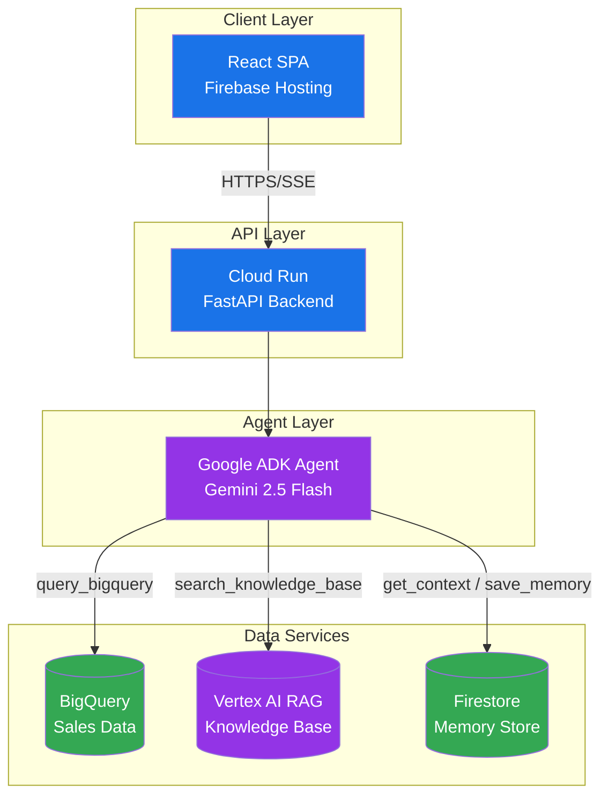
```mermaid
flowchart TB
    subgraph "Client Layer"
        UI[React SPA<br/>Firebase Hosting]
    end

    subgraph "API Layer"
        CR[Cloud Run<br/>FastAPI Backend]
    end

    subgraph "Agent Layer"
        AGENT[Google ADK Agent<br/>Gemini 2.5 Flash]
    end

    subgraph "Data Services"
        BQ[(BigQuery<br/>Sales Data)]
        RAG[(Vertex AI RAG<br/>Knowledge Base)]
        FS[(Firestore<br/>Memory Store)]
    end

    UI -->|HTTPS/SSE| CR
    CR --> AGENT
    AGENT -->|query_bigquery| BQ
    AGENT -->|search_knowledge_base| RAG
    AGENT -->|get_context / save_memory| FS

    style UI fill:#1A73E8,color:#fff
    style CR fill:#1A73E8,color:#fff
    style AGENT fill:#9334E6,color:#fff
    style BQ fill:#34A853,color:#fff
    style RAG fill:#9334E6,color:#fff
    style FS fill:#34A853,color:#fff
```

### Architecture Principles

1. **Serverless-First**: No infrastructure management; auto-scaling based on demand
2. **Event-Driven Streaming**: SSE for real-time response streaming
3. **Managed AI Services**: Vertex AI for embeddings, RAG, and LLM inference
4. **Separation of Concerns**: Clear boundaries between UI, API, Agent, and Data layers

---

## 3. GCP Services Selection

### 3.1 Compute & Hosting

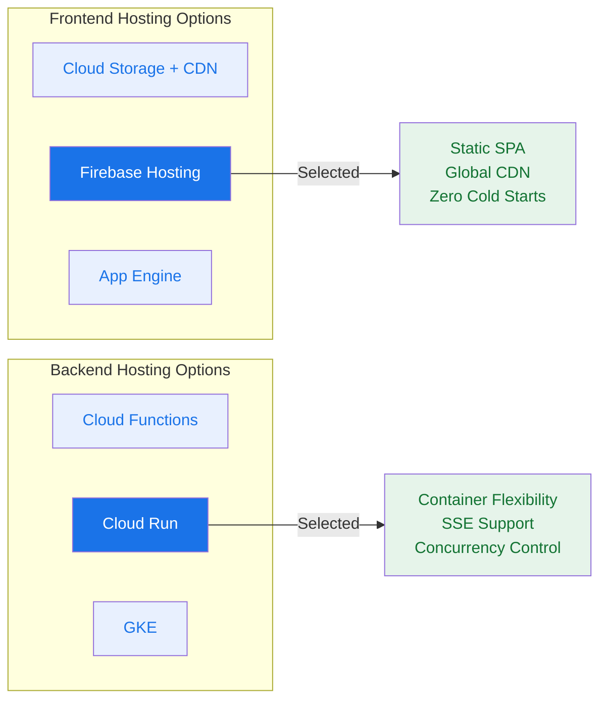
```mermaid
flowchart LR
    subgraph "Frontend Hosting Options"
        A[Cloud Storage + CDN]
        B[Firebase Hosting]
        C[App Engine]
    end

    subgraph "Backend Hosting Options"
        D[Cloud Functions]
        E[Cloud Run]
        F[GKE]
    end

    B -->|Selected| FRONTEND[Static SPA<br/>Global CDN<br/>Zero Cold Starts]
    E -->|Selected| BACKEND[Container Flexibility<br/>SSE Support<br/>Concurrency Control]

    style A fill:#E8F0FE,color:#1A73E8
    style B fill:#1A73E8,color:#fff
    style C fill:#E8F0FE,color:#1A73E8
    style D fill:#E8F0FE,color:#1A73E8
    style E fill:#1A73E8,color:#fff
    style F fill:#E8F0FE,color:#1A73E8
    style FRONTEND fill:#E6F4EA,color:#137333
    style BACKEND fill:#E6F4EA,color:#137333
```

| Service | Selection | Rationale |
|---------|-----------|-----------|
| **Firebase Hosting** | Frontend | Global CDN, automatic SSL, zero configuration deploys, instant rollback |
| **Cloud Run** | Backend | Container-native (Dockerfile), native SSE support, configurable concurrency, min-instances for warm-up |

**Why Cloud Run over Cloud Functions:**
- SSE streaming requires long-lived HTTP connections (functions timeout at 60s)
- Container flexibility allows custom Python dependencies
- Better control over instance scaling (min-instances for demos)

### 3.2 AI/ML Services

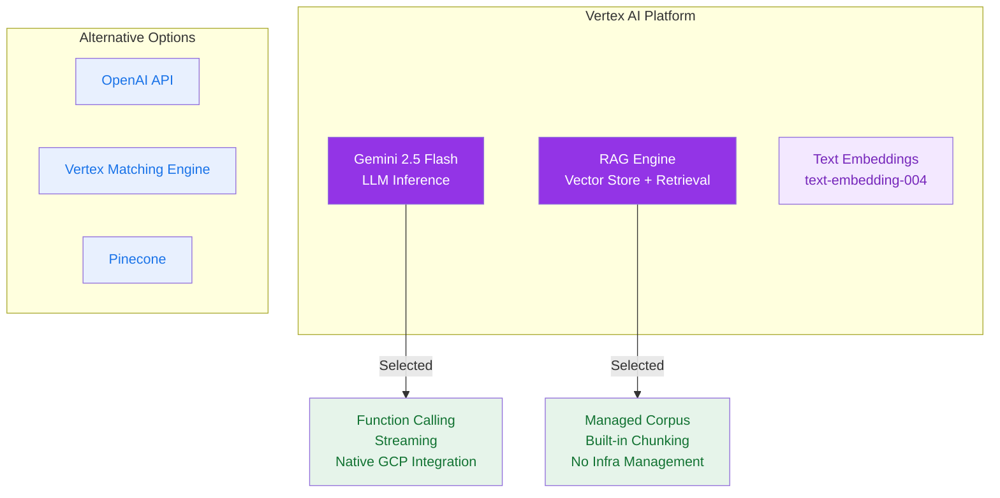
```mermaid
flowchart TB
    subgraph "Vertex AI Platform"
        GEMINI[Gemini 2.5 Flash<br/>LLM Inference]
        RAG_ENGINE[RAG Engine<br/>Vector Store + Retrieval]
        EMBED[Text Embeddings<br/>text-embedding-004]
    end

    subgraph "Alternative Options"
        OPENAI[OpenAI API]
        MATCHING[Vertex Matching Engine]
        PINECONE[Pinecone]
    end

    GEMINI -->|Selected| WHY_GEMINI[Function Calling<br/>Streaming<br/>Native GCP Integration]
    RAG_ENGINE -->|Selected| WHY_RAG[Managed Corpus<br/>Built-in Chunking<br/>No Infra Management]

    style GEMINI fill:#9334E6,color:#fff
    style RAG_ENGINE fill:#9334E6,color:#fff
    style EMBED fill:#F3E8FF,color:#7627BB
    style OPENAI fill:#E8F0FE,color:#1A73E8
    style MATCHING fill:#E8F0FE,color:#1A73E8
    style PINECONE fill:#E8F0FE,color:#1A73E8
    style WHY_GEMINI fill:#E6F4EA,color:#137333
    style WHY_RAG fill:#E6F4EA,color:#137333
```

| Service | Selection | Rationale |
|---------|-----------|-----------|
| **Gemini 2.5 Flash** | LLM | Fast inference, native function calling, streaming support, cost-effective |
| **Vertex AI RAG Engine** | Vector Store | Fully managed, automatic chunking, handles embeddings, no separate vector DB |

**Why Vertex AI RAG Engine over custom vector store:**
- Zero infrastructure: No need to manage Pinecone, Weaviate, or Matching Engine
- Automatic document chunking and embedding generation
- Built-in relevance scoring with configurable thresholds
- Native integration with Gemini models

### 3.3 Data Services

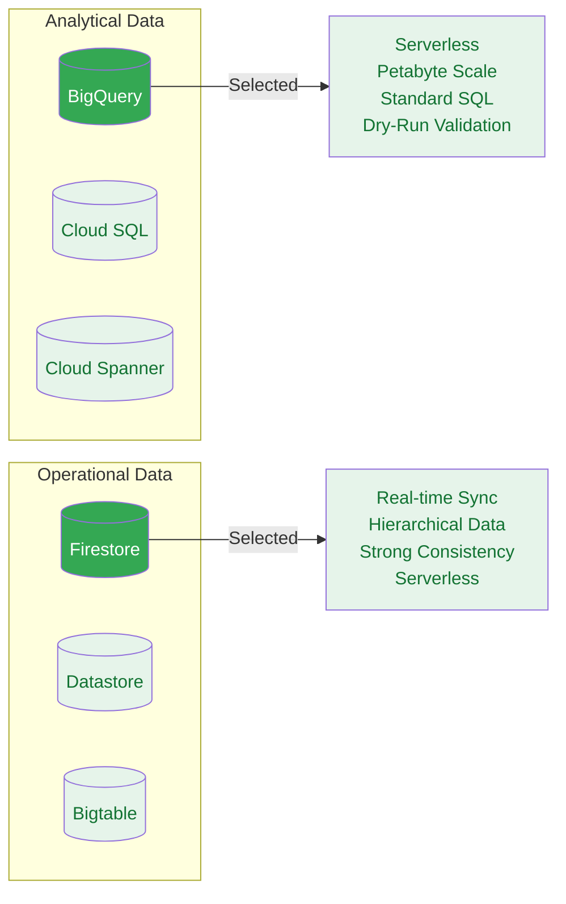
```mermaid
flowchart LR
    subgraph "Analytical Data"
        BQ[(BigQuery)]
        CLOUDSQL[(Cloud SQL)]
        SPANNER[(Cloud Spanner)]
    end

    subgraph "Operational Data"
        FS[(Firestore)]
        DATASTORE[(Datastore)]
        BIGTABLE[(Bigtable)]
    end

    BQ -->|Selected| WHY_BQ[Serverless<br/>Petabyte Scale<br/>Standard SQL<br/>Dry-Run Validation]
    FS -->|Selected| WHY_FS[Real-time Sync<br/>Hierarchical Data<br/>Strong Consistency<br/>Serverless]

    style BQ fill:#34A853,color:#fff
    style CLOUDSQL fill:#E6F4EA,color:#137333
    style SPANNER fill:#E6F4EA,color:#137333
    style FS fill:#34A853,color:#fff
    style DATASTORE fill:#E6F4EA,color:#137333
    style BIGTABLE fill:#E6F4EA,color:#137333
    style WHY_BQ fill:#E6F4EA,color:#137333
    style WHY_FS fill:#E6F4EA,color:#137333
```

| Service | Selection | Use Case | Rationale |
|---------|-----------|----------|-----------|
| **BigQuery** | Analytical queries | Sales transactions, targets | Serverless, cost-effective (pay-per-query), dry-run validation for safety |
| **Firestore** | User memory & sessions | Conversation history, user preferences | Real-time listeners, hierarchical documents, strong consistency |

**Why Firestore over Datastore:**
- Native document model fits user memory structure (nested findings, preferences)
- Real-time listeners (future: live memory updates)
- Better local development experience with emulator

---

## 4. Component Architecture

### 4.1 Backend Component Diagram

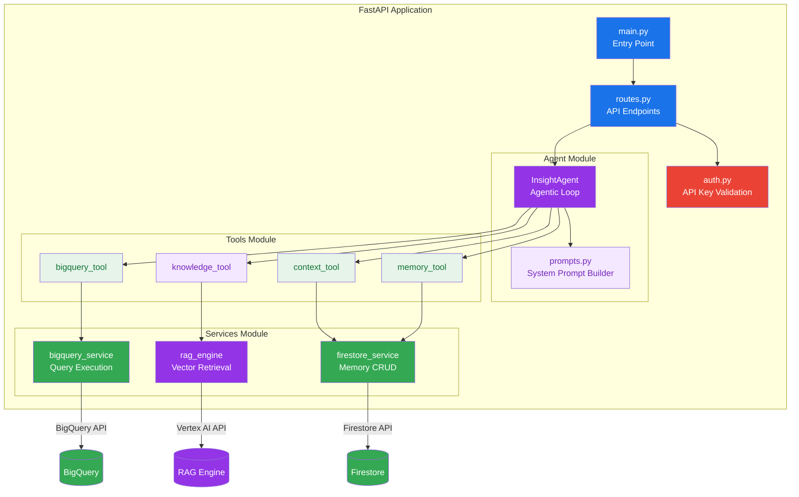
```mermaid
flowchart TB
    subgraph "FastAPI Application"
        MAIN[main.py<br/>Entry Point]
        ROUTES[routes.py<br/>API Endpoints]
        AUTH[auth.py<br/>API Key Validation]

        subgraph "Agent Module"
            AGENT[InsightAgent<br/>Agentic Loop]
            PROMPTS[prompts.py<br/>System Prompt Builder]
        end

        subgraph "Tools Module"
            T1[bigquery_tool]
            T2[knowledge_tool]
            T3[context_tool]
            T4[memory_tool]
        end

        subgraph "Services Module"
            S1[bigquery_service<br/>Query Execution]
            S2[rag_engine<br/>Vector Retrieval]
            S3[firestore_service<br/>Memory CRUD]
        end
    end

    MAIN --> ROUTES
    ROUTES --> AUTH
    ROUTES --> AGENT
    AGENT --> PROMPTS
    AGENT --> T1 & T2 & T3 & T4
    T1 --> S1
    T2 --> S2
    T3 & T4 --> S3

    S1 -->|BigQuery API| BQ[(BigQuery)]
    S2 -->|Vertex AI API| RAG[(RAG Engine)]
    S3 -->|Firestore API| FS[(Firestore)]

    style MAIN fill:#1A73E8,color:#fff
    style ROUTES fill:#1A73E8,color:#fff
    style AUTH fill:#EA4335,color:#fff
    style AGENT fill:#9334E6,color:#fff
    style PROMPTS fill:#F3E8FF,color:#7627BB
    style T1 fill:#E6F4EA,color:#137333
    style T2 fill:#F3E8FF,color:#7627BB
    style T3 fill:#E6F4EA,color:#137333
    style T4 fill:#E6F4EA,color:#137333
    style S1 fill:#34A853,color:#fff
    style S2 fill:#9334E6,color:#fff
    style S3 fill:#34A853,color:#fff
    style BQ fill:#34A853,color:#fff
    style RAG fill:#9334E6,color:#fff
    style FS fill:#34A853,color:#fff
```

### 4.2 Agent Architecture

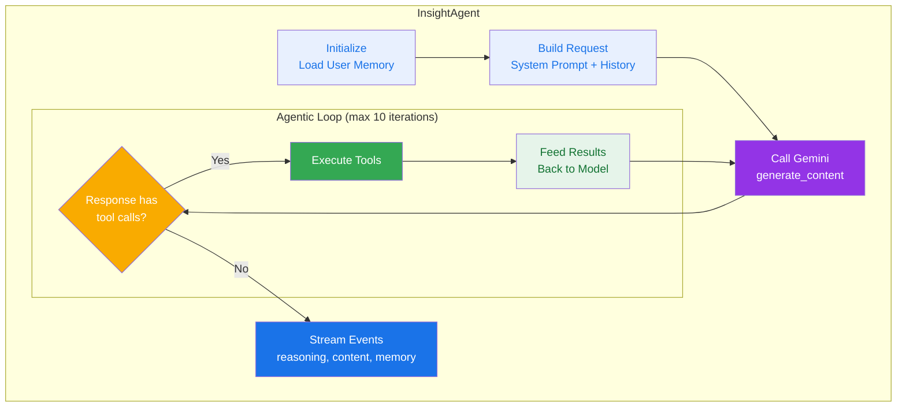
```mermaid
flowchart TB
    subgraph "InsightAgent"
        INIT[Initialize<br/>Load User Memory]
        BUILD[Build Request<br/>System Prompt + History]
        CALL[Call Gemini<br/>generate_content]

        subgraph "Agentic Loop (max 10 iterations)"
            CHECK{Response has<br/>tool calls?}
            EXEC[Execute Tools]
            FEED[Feed Results<br/>Back to Model]
        end

        STREAM[Stream Events<br/>reasoning, content, memory]
    end

    INIT --> BUILD --> CALL --> CHECK
    CHECK -->|Yes| EXEC --> FEED --> CALL
    CHECK -->|No| STREAM

    style INIT fill:#E8F0FE,color:#1A73E8
    style BUILD fill:#E8F0FE,color:#1A73E8
    style CALL fill:#9334E6,color:#fff
    style CHECK fill:#F9AB00,color:#fff
    style EXEC fill:#34A853,color:#fff
    style FEED fill:#E6F4EA,color:#137333
    style STREAM fill:#1A73E8,color:#fff
```

### 4.3 Frontend Component Diagram

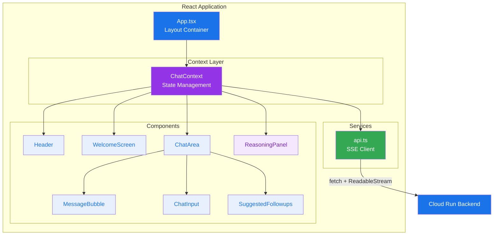
```mermaid
flowchart TB
    subgraph "React Application"
        APP[App.tsx<br/>Layout Container]

        subgraph "Context Layer"
            CTX[ChatContext<br/>State Management]
        end

        subgraph "Components"
            HEADER[Header]
            WELCOME[WelcomeScreen]
            CHAT[ChatArea]
            MSG[MessageBubble]
            INPUT[ChatInput]
            REASON[ReasoningPanel]
            FOLLOWUP[SuggestedFollowups]
        end

        subgraph "Services"
            API[api.ts<br/>SSE Client]
        end
    end

    APP --> CTX
    CTX --> HEADER & WELCOME & CHAT & REASON
    CHAT --> MSG & INPUT & FOLLOWUP
    CTX --> API
    API -->|fetch + ReadableStream| BACKEND[Cloud Run Backend]

    style APP fill:#1A73E8,color:#fff
    style CTX fill:#9334E6,color:#fff
    style HEADER fill:#E8F0FE,color:#1A73E8
    style WELCOME fill:#E8F0FE,color:#1A73E8
    style CHAT fill:#E8F0FE,color:#1A73E8
    style MSG fill:#E8F0FE,color:#1A73E8
    style INPUT fill:#E8F0FE,color:#1A73E8
    style REASON fill:#F3E8FF,color:#7627BB
    style FOLLOWUP fill:#E8F0FE,color:#1A73E8
    style API fill:#34A853,color:#fff
    style BACKEND fill:#1A73E8,color:#fff
```

---

## 5. Data Flow & Sequence Diagrams

### 5.1 Chat Message Flow (SSE Streaming)

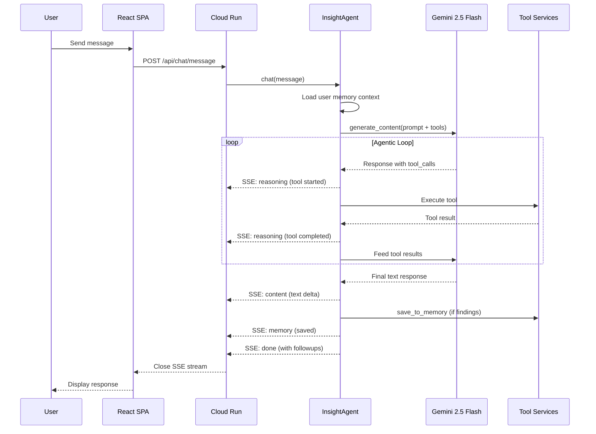
```mermaid
sequenceDiagram
    participant User
    participant Frontend as React SPA
    participant Backend as Cloud Run
    participant Agent as InsightAgent
    participant Gemini as Gemini 2.5 Flash
    participant Tools as Tool Services

    User->>Frontend: Send message
    Frontend->>Backend: POST /api/chat/message
    Backend->>Agent: chat(message)

    Agent->>Agent: Load user memory context
    Agent->>Gemini: generate_content(prompt + tools)

    loop Agentic Loop
        Gemini-->>Agent: Response with tool_calls
        Agent-->>Backend: SSE: reasoning (tool started)
        Agent->>Tools: Execute tool
        Tools-->>Agent: Tool result
        Agent-->>Backend: SSE: reasoning (tool completed)
        Agent->>Gemini: Feed tool results
    end

    Gemini-->>Agent: Final text response
    Agent-->>Backend: SSE: content (text delta)
    Agent->>Tools: save_to_memory (if findings)
    Agent-->>Backend: SSE: memory (saved)
    Agent-->>Backend: SSE: done (with followups)

    Backend-->>Frontend: Close SSE stream
    Frontend-->>User: Display response
```

### 5.2 RAG Retrieval Flow

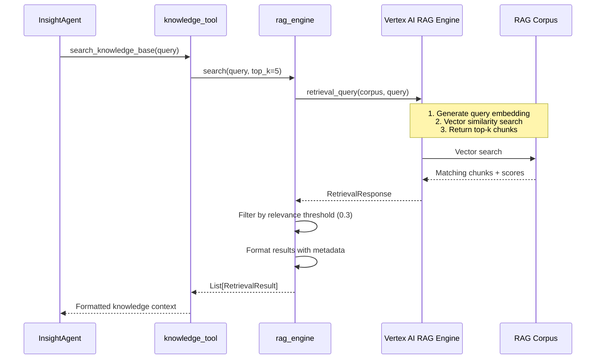
```mermaid
sequenceDiagram
    participant Agent as InsightAgent
    participant Tool as knowledge_tool
    participant Service as rag_engine
    participant Vertex as Vertex AI RAG Engine
    participant Corpus as RAG Corpus

    Agent->>Tool: search_knowledge_base(query)
    Tool->>Service: search(query, top_k=5)
    Service->>Vertex: retrieval_query(corpus, query)

    Note over Vertex,Corpus: 1. Generate query embedding<br/>2. Vector similarity search<br/>3. Return top-k chunks

    Vertex->>Corpus: Vector search
    Corpus-->>Vertex: Matching chunks + scores
    Vertex-->>Service: RetrievalResponse

    Service->>Service: Filter by relevance threshold (0.3)
    Service->>Service: Format results with metadata
    Service-->>Tool: List[RetrievalResult]
    Tool-->>Agent: Formatted knowledge context
```

### 5.3 BigQuery Tool Flow

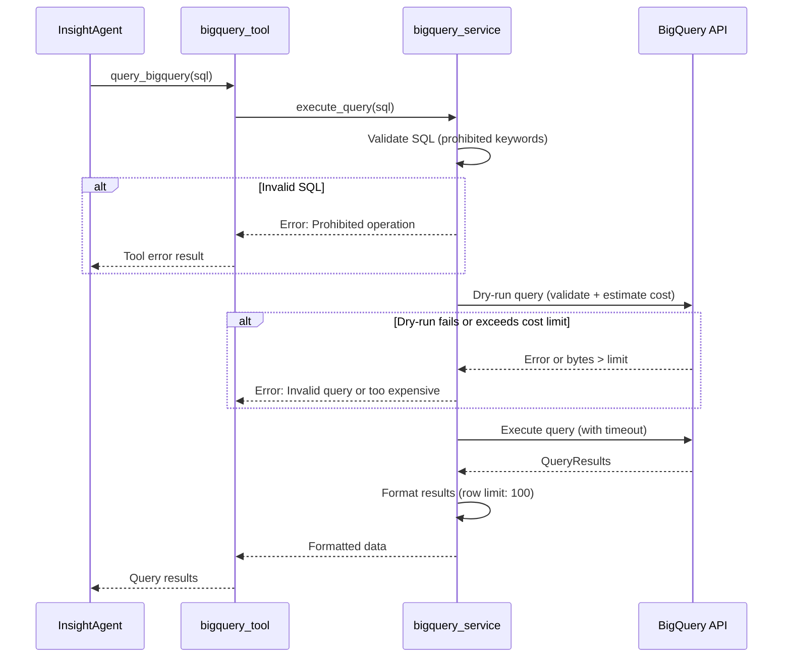
```mermaid
sequenceDiagram
    participant Agent as InsightAgent
    participant Tool as bigquery_tool
    participant Service as bigquery_service
    participant BQ as BigQuery API

    Agent->>Tool: query_bigquery(sql)
    Tool->>Service: execute_query(sql)

    Service->>Service: Validate SQL (prohibited keywords)

    alt Invalid SQL
        Service-->>Tool: Error: Prohibited operation
        Tool-->>Agent: Tool error result
    end

    Service->>BQ: Dry-run query (validate + estimate cost)

    alt Dry-run fails or exceeds cost limit
        BQ-->>Service: Error or bytes > limit
        Service-->>Tool: Error: Invalid query or too expensive
    end

    Service->>BQ: Execute query (with timeout)
    BQ-->>Service: QueryResults

    Service->>Service: Format results (row limit: 100)
    Service-->>Tool: Formatted data
    Tool-->>Agent: Query results
```

### 5.4 Memory Persistence Flow

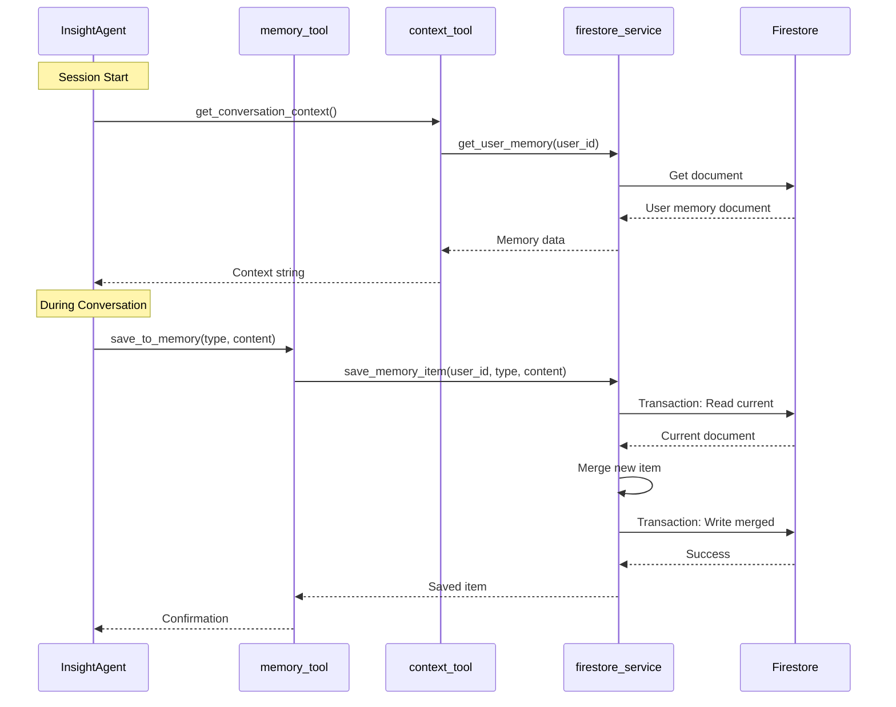
```mermaid
sequenceDiagram
    participant Agent as InsightAgent
    participant MemTool as memory_tool
    participant CtxTool as context_tool
    participant Service as firestore_service
    participant FS as Firestore

    Note over Agent: Session Start
    Agent->>CtxTool: get_conversation_context()
    CtxTool->>Service: get_user_memory(user_id)
    Service->>FS: Get document
    FS-->>Service: User memory document
    Service-->>CtxTool: Memory data
    CtxTool-->>Agent: Context string

    Note over Agent: During Conversation
    Agent->>MemTool: save_to_memory(type, content)
    MemTool->>Service: save_memory_item(user_id, type, content)

    Service->>FS: Transaction: Read current
    FS-->>Service: Current document
    Service->>Service: Merge new item
    Service->>FS: Transaction: Write merged
    FS-->>Service: Success

    Service-->>MemTool: Saved item
    MemTool-->>Agent: Confirmation
```

---

## 6. Deployment Architecture

### 6.1 Deployment Pipeline

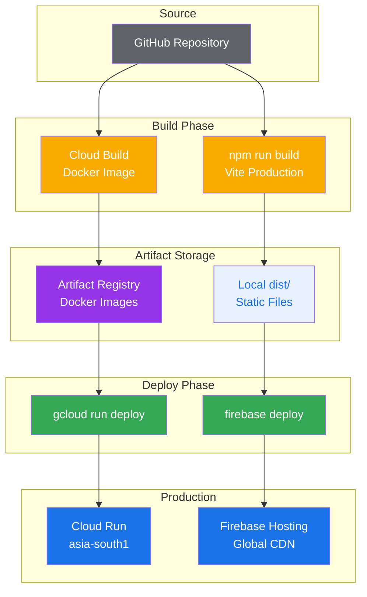
```mermaid
flowchart TB
    subgraph "Source"
        CODE[GitHub Repository]
    end

    subgraph "Build Phase"
        BUILD_BE[Cloud Build<br/>Docker Image]
        BUILD_FE[npm run build<br/>Vite Production]
    end

    subgraph "Artifact Storage"
        AR[Artifact Registry<br/>Docker Images]
        DIST[Local dist/<br/>Static Files]
    end

    subgraph "Deploy Phase"
        DEPLOY_BE[gcloud run deploy]
        DEPLOY_FE[firebase deploy]
    end

    subgraph "Production"
        CR[Cloud Run<br/>asia-south1]
        FH[Firebase Hosting<br/>Global CDN]
    end

    CODE --> BUILD_BE --> AR --> DEPLOY_BE --> CR
    CODE --> BUILD_FE --> DIST --> DEPLOY_FE --> FH

    style CODE fill:#5F6368,color:#fff
    style BUILD_BE fill:#F9AB00,color:#fff
    style BUILD_FE fill:#F9AB00,color:#fff
    style AR fill:#9334E6,color:#fff
    style DIST fill:#E8F0FE,color:#1A73E8
    style DEPLOY_BE fill:#34A853,color:#fff
    style DEPLOY_FE fill:#34A853,color:#fff
    style CR fill:#1A73E8,color:#fff
    style FH fill:#1A73E8,color:#fff
```

### 6.2 Infrastructure Diagram

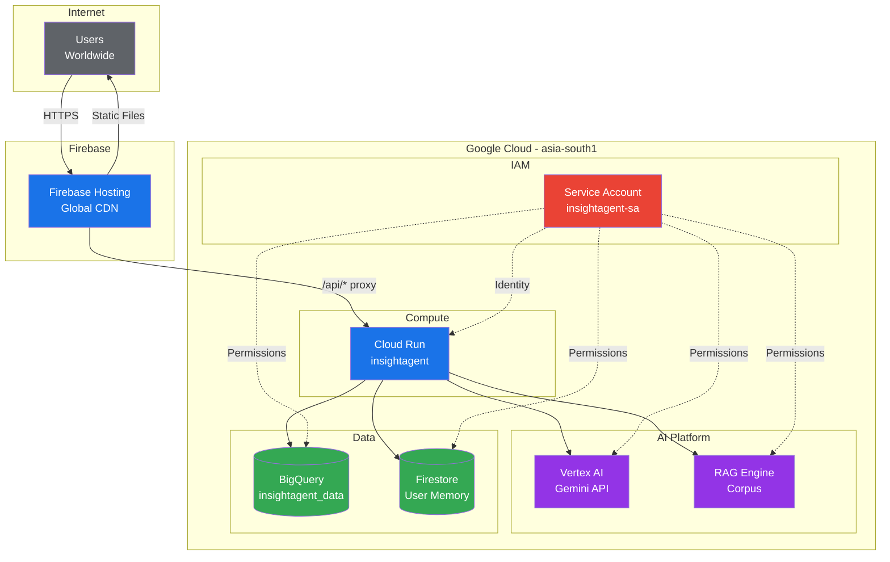
```mermaid
flowchart TB
    subgraph "Internet"
        USERS[Users<br/>Worldwide]
    end

    subgraph "Firebase"
        CDN[Firebase Hosting<br/>Global CDN]
    end

    subgraph "Google Cloud - asia-south1"
        subgraph "Compute"
            CR[Cloud Run<br/>insightagent]
        end

        subgraph "AI Platform"
            VERTEX[Vertex AI<br/>Gemini API]
            RAG[RAG Engine<br/>Corpus]
        end

        subgraph "Data"
            BQ[(BigQuery<br/>insightagent_data)]
            FS[(Firestore<br/>User Memory)]
        end

        subgraph "IAM"
            SA[Service Account<br/>insightagent-sa]
        end
    end

    USERS -->|HTTPS| CDN
    CDN -->|Static Files| USERS
    CDN -->|/api/* proxy| CR

    CR --> VERTEX
    CR --> RAG
    CR --> BQ
    CR --> FS

    SA -.->|Identity| CR
    SA -.->|Permissions| VERTEX & RAG & BQ & FS

    style USERS fill:#5F6368,color:#fff
    style CDN fill:#1A73E8,color:#fff
    style CR fill:#1A73E8,color:#fff
    style VERTEX fill:#9334E6,color:#fff
    style RAG fill:#9334E6,color:#fff
    style BQ fill:#34A853,color:#fff
    style FS fill:#34A853,color:#fff
    style SA fill:#EA4335,color:#fff
```

### 6.3 Deployment Commands

```bash
# Full deployment
./scripts/deploy.sh all

# Individual deployments
./scripts/deploy.sh backend   # Cloud Run
./scripts/deploy.sh frontend  # Firebase Hosting

# Demo warm-up (reduce cold starts)
./scripts/deploy.sh warmup    # min-instances=1
./scripts/deploy.sh cooldown  # min-instances=0
```

### 6.4 Cloud Run Configuration

| Setting | Value | Rationale |
|---------|-------|-----------|
| **Region** | asia-south1 | Proximity to users, Vertex AI availability |
| **Memory** | 2GB | Buffer for Gemini client, concurrent requests |
| **CPU** | 2 | Handle multiple tool executions |
| **Min Instances** | 0 (default) / 1 (demo) | Cost optimization vs latency |
| **Max Instances** | 5 | Prevent runaway scaling |
| **Timeout** | 300s | Long-running agentic loops |
| **Concurrency** | 80 | Handle multiple SSE streams |

---

## 7. Security Architecture

### 7.1 Authentication & Authorization Flow

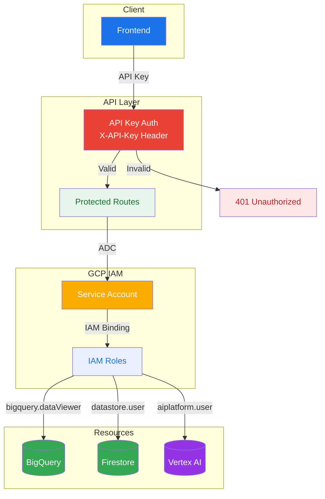
```mermaid
flowchart TB
    subgraph "Client"
        FE[Frontend]
    end

    subgraph "API Layer"
        AUTH[API Key Auth<br/>X-API-Key Header]
        ROUTES[Protected Routes]
    end

    subgraph "GCP IAM"
        SA[Service Account]
        ROLES[IAM Roles]
    end

    subgraph "Resources"
        BQ[(BigQuery)]
        FS[(Firestore)]
        VA[(Vertex AI)]
    end

    FE -->|API Key| AUTH
    AUTH -->|Valid| ROUTES
    AUTH -->|Invalid| REJECT[401 Unauthorized]

    ROUTES -->|ADC| SA
    SA -->|IAM Binding| ROLES
    ROLES -->|bigquery.dataViewer| BQ
    ROLES -->|datastore.user| FS
    ROLES -->|aiplatform.user| VA

    style FE fill:#1A73E8,color:#fff
    style AUTH fill:#EA4335,color:#fff
    style ROUTES fill:#E6F4EA,color:#137333
    style REJECT fill:#FCE8E6,color:#C5221F
    style SA fill:#F9AB00,color:#fff
    style ROLES fill:#E8F0FE,color:#1A73E8
    style BQ fill:#34A853,color:#fff
    style FS fill:#34A853,color:#fff
    style VA fill:#9334E6,color:#fff
```

### 7.2 Security Controls

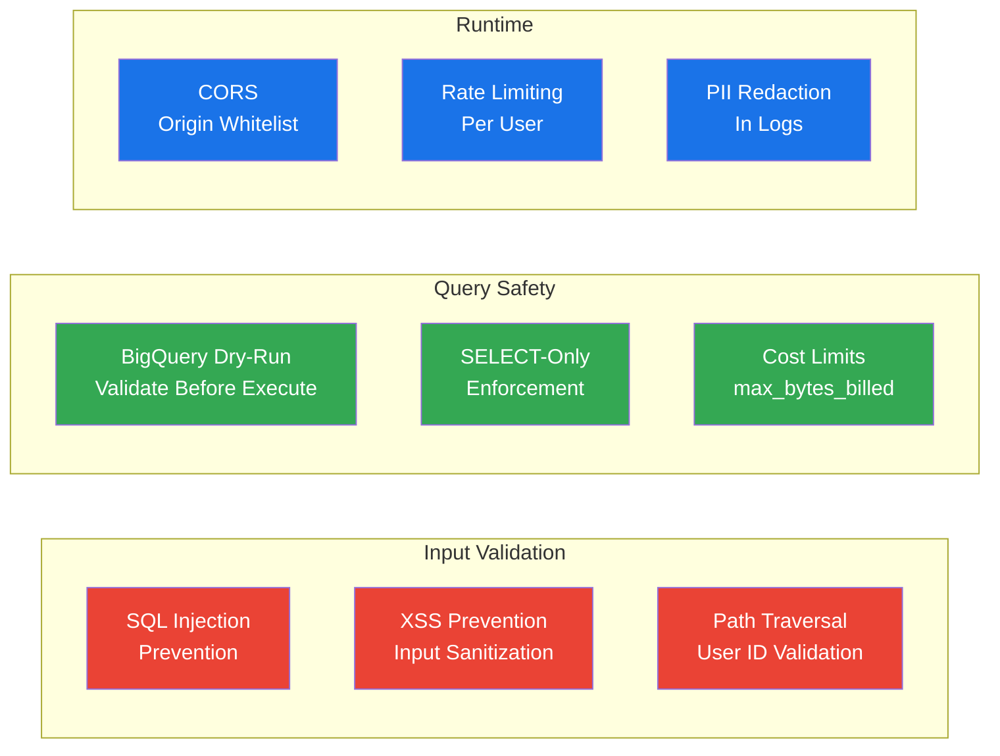
```mermaid
flowchart LR
    subgraph "Input Validation"
        SQL[SQL Injection<br/>Prevention]
        XSS[XSS Prevention<br/>Input Sanitization]
        PATH[Path Traversal<br/>User ID Validation]
    end

    subgraph "Query Safety"
        DRYRUN[BigQuery Dry-Run<br/>Validate Before Execute]
        READONLY[SELECT-Only<br/>Enforcement]
        COST[Cost Limits<br/>max_bytes_billed]
    end

    subgraph "Runtime"
        CORS[CORS<br/>Origin Whitelist]
        RATE[Rate Limiting<br/>Per User]
        LOG[PII Redaction<br/>In Logs]
    end

    style SQL fill:#EA4335,color:#fff
    style XSS fill:#EA4335,color:#fff
    style PATH fill:#EA4335,color:#fff
    style DRYRUN fill:#34A853,color:#fff
    style READONLY fill:#34A853,color:#fff
    style COST fill:#34A853,color:#fff
    style CORS fill:#1A73E8,color:#fff
    style RATE fill:#1A73E8,color:#fff
    style LOG fill:#1A73E8,color:#fff
```

| Control | Implementation |
|---------|----------------|
| **API Authentication** | API key in `X-API-Key` header, validated in middleware |
| **SQL Injection** | Prohibited keyword list (DROP, DELETE, UPDATE, etc.) |
| **Query Validation** | BigQuery dry-run validates syntax and permissions |
| **Cost Control** | `maximum_bytes_billed` prevents expensive queries |
| **SELECT-Only** | Dry-run rejects non-SELECT statements |
| **CORS** | Whitelist of allowed origins |
| **User ID Validation** | Alphanumeric only, prevents path traversal |

---

## 8. Scalability & Performance

### 8.1 Scaling Architecture

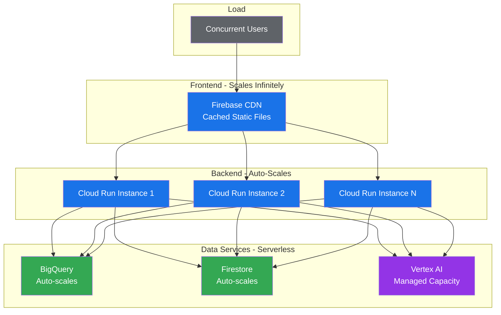
```mermaid
flowchart TB
    subgraph "Load"
        USERS[Concurrent Users]
    end

    subgraph "Frontend - Scales Infinitely"
        CDN[Firebase CDN<br/>Cached Static Files]
    end

    subgraph "Backend - Auto-Scales"
        CR1[Cloud Run Instance 1]
        CR2[Cloud Run Instance 2]
        CRN[Cloud Run Instance N]
    end

    subgraph "Data Services - Serverless"
        BQ[BigQuery<br/>Auto-scales]
        FS[Firestore<br/>Auto-scales]
        VA[Vertex AI<br/>Managed Capacity]
    end

    USERS --> CDN
    CDN --> CR1 & CR2 & CRN
    CR1 & CR2 & CRN --> BQ & FS & VA

    style USERS fill:#5F6368,color:#fff
    style CDN fill:#1A73E8,color:#fff
    style CR1 fill:#1A73E8,color:#fff
    style CR2 fill:#1A73E8,color:#fff
    style CRN fill:#1A73E8,color:#fff
    style BQ fill:#34A853,color:#fff
    style FS fill:#34A853,color:#fff
    style VA fill:#9334E6,color:#fff
```

### 8.2 Performance Characteristics

| Component | Latency | Scaling |
|-----------|---------|---------|
| **Firebase CDN** | ~50ms | Global edge, infinite scale |
| **Cloud Run** | 2-5s cold start, ~100ms warm | 0-5 instances auto-scale |
| **BigQuery** | 1-3s per query | Serverless, parallel execution |
| **Vertex AI RAG** | 500ms-1s | Managed, no config needed |
| **Gemini API** | 2-4s first token | Managed, quota-based |
| **Firestore** | ~50ms reads, ~100ms writes | Auto-scales with traffic |

### 8.3 Cold Start Mitigation

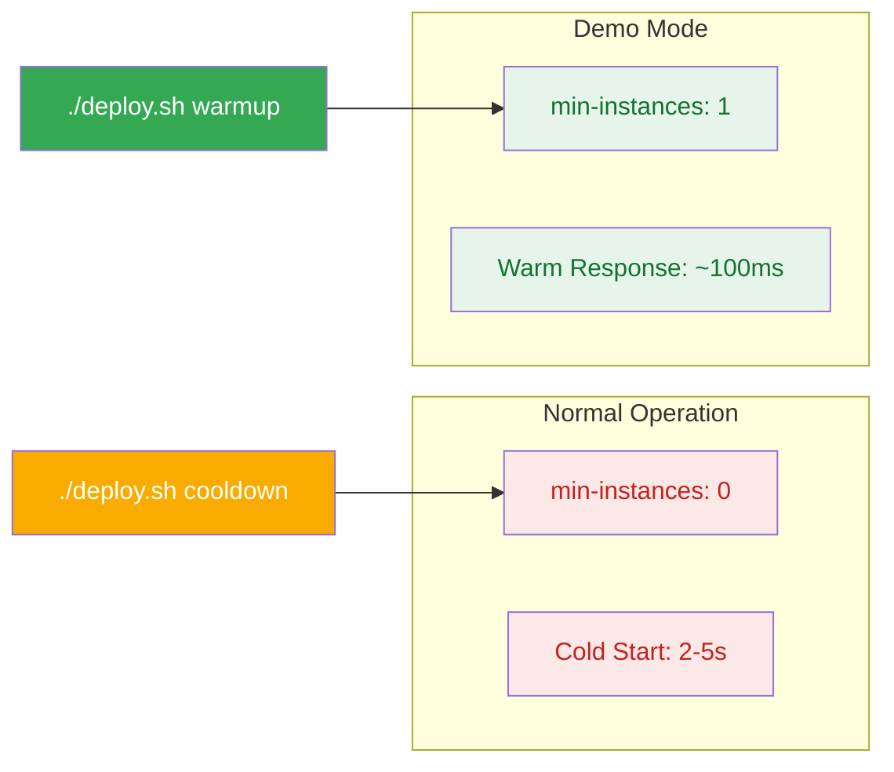
```mermaid
flowchart LR
    subgraph "Normal Operation"
        MIN0[min-instances: 0]
        COLD[Cold Start: 2-5s]
    end

    subgraph "Demo Mode"
        MIN1[min-instances: 1]
        WARM[Warm Response: ~100ms]
    end

    WARMUP[./deploy.sh warmup] --> MIN1
    COOLDOWN[./deploy.sh cooldown] --> MIN0

    style MIN0 fill:#FCE8E6,color:#C5221F
    style COLD fill:#FCE8E6,color:#C5221F
    style MIN1 fill:#E6F4EA,color:#137333
    style WARM fill:#E6F4EA,color:#137333
    style WARMUP fill:#34A853,color:#fff
    style COOLDOWN fill:#F9AB00,color:#fff
```

**Warm-up Strategy:**
- Default: `min-instances=0` for cost optimization
- Before demos: `./scripts/deploy.sh warmup` sets `min-instances=1`
- After demos: `./scripts/deploy.sh cooldown` reverts to 0

---

## 9. Cost & Billing

Our architecture leverages GCP's serverless and pay-per-use pricing models to minimize costs during development and low-traffic periods while providing seamless scaling for production workloads.

### 9.1 Cost Model Overview

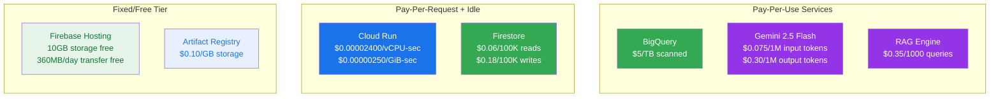
```mermaid
flowchart TB
    subgraph "Pay-Per-Use Services"
        direction TB
        BQ[BigQuery<br/>$5/TB scanned]
        GEMINI[Gemini 2.5 Flash<br/>$0.075/1M input tokens<br/>$0.30/1M output tokens]
        RAG[RAG Engine<br/>$0.35/1000 queries]
    end

    subgraph "Pay-Per-Request + Idle"
        direction TB
        CR[Cloud Run<br/>$0.00002400/vCPU-sec<br/>$0.00000250/GiB-sec]
        FS[Firestore<br/>$0.06/100K reads<br/>$0.18/100K writes]
    end

    subgraph "Fixed/Free Tier"
        direction TB
        FH[Firebase Hosting<br/>10GB storage free<br/>360MB/day transfer free]
        AR[Artifact Registry<br/>$0.10/GB storage]
    end

    style BQ fill:#34A853,color:#fff
    style GEMINI fill:#9334E6,color:#fff
    style RAG fill:#9334E6,color:#fff
    style CR fill:#1A73E8,color:#fff
    style FS fill:#34A853,color:#fff
    style FH fill:#E6F4EA,color:#137333
    style AR fill:#E8F0FE,color:#1A73E8
```

### 9.2 Service-by-Service Cost Breakdown

| Service | Pricing Model | Current Config | Estimated Monthly Cost (Dev) | Estimated Monthly Cost (Prod) |
|---------|---------------|----------------|------------------------------|-------------------------------|
| **Cloud Run** | CPU/Memory per second | 2 vCPU, 2GB, min=0 | $0-5 (idle most time) | $50-200 (1000 req/day) |
| **Firebase Hosting** | Storage + bandwidth | Static SPA (~5MB) | $0 (free tier) | $0-10 (within free tier) |
| **BigQuery** | Per TB scanned | ~10MB demo dataset | $0 (free tier: 1TB/mo) | $5-50 (depends on query volume) |
| **Firestore** | Read/Write operations | Per-user documents | $0-1 (low volume) | $10-50 (10K users) |
| **Vertex AI Gemini** | Input/Output tokens | ~2K tokens/request | $5-20 (testing) | $100-500 (1000 req/day) |
| **RAG Engine** | Per 1000 queries | Corpus: 5 docs | $0-5 (testing) | $35-100 (1000 req/day) |
| **Artifact Registry** | Storage per GB | ~500MB image | $0.05 | $0.05 |

**Total Estimated Cost:**
- **Development/Demo:** $5-30/month
- **Production (1000 requests/day):** $200-900/month

### 9.3 Why Our Architecture is Cost-Effective

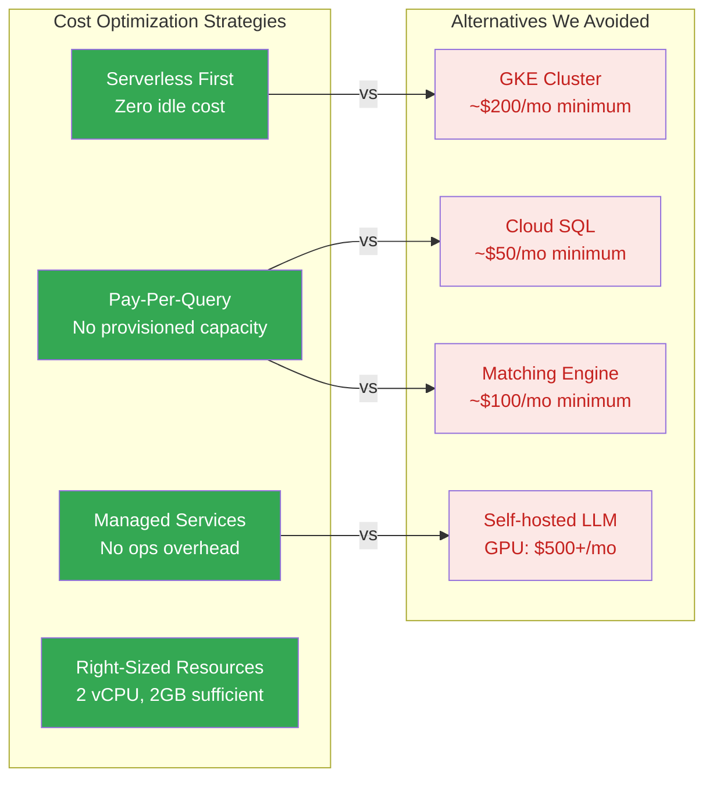
```mermaid
flowchart LR
    subgraph "Cost Optimization Strategies"
        S1[Serverless First<br/>Zero idle cost]
        S2[Pay-Per-Query<br/>No provisioned capacity]
        S3[Managed Services<br/>No ops overhead]
        S4[Right-Sized Resources<br/>2 vCPU, 2GB sufficient]
    end

    subgraph "Alternatives We Avoided"
        A1[GKE Cluster<br/>~$200/mo minimum]
        A2[Cloud SQL<br/>~$50/mo minimum]
        A3[Matching Engine<br/>~$100/mo minimum]
        A4[Self-hosted LLM<br/>GPU: $500+/mo]
    end

    S1 -->|vs| A1
    S2 -->|vs| A2
    S2 -->|vs| A3
    S3 -->|vs| A4

    style S1 fill:#34A853,color:#fff
    style S2 fill:#34A853,color:#fff
    style S3 fill:#34A853,color:#fff
    style S4 fill:#34A853,color:#fff
    style A1 fill:#FCE8E6,color:#C5221F
    style A2 fill:#FCE8E6,color:#C5221F
    style A3 fill:#FCE8E6,color:#C5221F
    style A4 fill:#FCE8E6,color:#C5221F
```

| Strategy | Implementation | Savings |
|----------|----------------|---------|
| **Serverless Compute** | Cloud Run with min-instances=0 | No cost when idle (vs $200+/mo for GKE) |
| **Managed Vector Store** | Vertex AI RAG Engine | No infrastructure (vs $100+/mo for Matching Engine) |
| **Pay-Per-Query Analytics** | BigQuery on-demand | No provisioned slots (vs $2000+/mo for flat-rate) |
| **Flash Model** | Gemini 2.5 Flash vs Pro | 10x cheaper per token |
| **Efficient Embedding** | RAG Engine handles embeddings | No separate Embedding API calls |
| **CDN for Frontend** | Firebase Hosting free tier | Zero frontend hosting cost |

### 9.4 Cost Control Mechanisms


```mermaid
flowchart TB
    subgraph "Query Cost Controls"
        DRY[BigQuery Dry-Run<br/>Estimate before execute]
        MAX[maximum_bytes_billed<br/>Hard limit per query]
        ROW[Row Limit: 100<br/>Prevent large results]
    end

    subgraph "Compute Controls"
        MIN[min-instances: 0<br/>Scale to zero]
        MAXINST[max-instances: 5<br/>Cap scaling]
        TIMEOUT[Timeout: 300s<br/>Kill runaway requests]
    end

    subgraph "Token Controls"
        LOOP[Max 10 iterations<br/>Cap agentic loops]
        PROMPT[Efficient prompts<br/>Minimize input tokens]
        STREAM[SSE Streaming<br/>Early termination]
    end

    DRY --> SAFE[Cost-Safe<br/>Operations]
    MAX --> SAFE
    ROW --> SAFE
    MIN --> SAFE
    MAXINST --> SAFE
    TIMEOUT --> SAFE
    LOOP --> SAFE
    PROMPT --> SAFE
    STREAM --> SAFE

    style DRY fill:#34A853,color:#fff
    style MAX fill:#34A853,color:#fff
    style ROW fill:#34A853,color:#fff
    style MIN fill:#1A73E8,color:#fff
    style MAXINST fill:#1A73E8,color:#fff
    style TIMEOUT fill:#1A73E8,color:#fff
    style LOOP fill:#9334E6,color:#fff
    style PROMPT fill:#9334E6,color:#fff
    style STREAM fill:#9334E6,color:#fff
    style SAFE fill:#E6F4EA,color:#137333
```

**Implemented Controls:**

| Control | Location | Purpose |
|---------|----------|---------|
| `maximum_bytes_billed` | `bigquery_service.py` | Reject queries that would scan >10GB (configurable via `max_query_bytes`) |
| Row limit (1000) | `bigquery_service.py` | Cap returned rows (configurable via `max_result_rows`) |
| Dry-run validation | `bigquery_service.py` | Estimate cost before execution |
| `max-instances: 5` | Cloud Run config | Prevent runaway scaling |
| `min-instances: 0` | Cloud Run config | Scale to zero when idle |
| Max 10 iterations | `insight_agent.py` | Cap agentic tool loops |
| Request timeout | Cloud Run (300s) | Kill long-running requests |

### 9.5 Production Scaling Opportunities

```mermaid
flowchart TB
    subgraph "Current State"
        NOW[Development Config<br/>min=0, max=5<br/>~$30/mo]
    end

    subgraph "Scale Level 1: 10K Users"
        L1[Warm Instances<br/>min=2, max=10<br/>~$500/mo]
    end

    subgraph "Scale Level 2: 100K Users"
        L2[Multi-Region<br/>Load Balancer<br/>~$2000/mo]
    end

    subgraph "Scale Level 3: Enterprise"
        L3[Reserved Capacity<br/>Committed Use Discounts<br/>Flat-Rate BigQuery<br/>~$5000+/mo]
    end

    NOW -->|Traffic Increase| L1
    L1 -->|Geographic Expansion| L2
    L2 -->|Enterprise SLA| L3

    style NOW fill:#E8F0FE,color:#1A73E8
    style L1 fill:#D2E3FC,color:#1A73E8
    style L2 fill:#A8C7FA,color:#174EA6
    style L3 fill:#1A73E8,color:#fff
```

#### Scaling Configurations

| Scale Level | Users | Config Changes | Estimated Cost |
|-------------|-------|----------------|----------------|
| **Development** | <100 | Current (min=0, max=5) | $30/mo |
| **Production Small** | 1K-10K | min=2, max=20, 4GB RAM | $300-800/mo |
| **Production Medium** | 10K-100K | Multi-region, Load Balancer, BQ slots | $1500-3000/mo |
| **Enterprise** | 100K+ | Committed Use, Flat-Rate BQ, Support | $5000+/mo |

#### Production Scaling Playbook

**Level 1: Warm Instances (10K users)**
```bash
# Update Cloud Run for consistent latency
gcloud run services update insightagent \
  --min-instances=2 \
  --max-instances=20 \
  --memory=4Gi \
  --cpu=4
```

**Level 2: Multi-Region (100K users)**
```bash
# Deploy to multiple regions
gcloud run deploy insightagent --region=us-central1
gcloud run deploy insightagent --region=europe-west1

# Add Global Load Balancer
gcloud compute backend-services create insightagent-backend \
  --global \
  --load-balancing-scheme=EXTERNAL_MANAGED
```

**Level 3: Enterprise Discounts**
- **Committed Use Discounts (CUD):** 1-3 year commitments for 30-50% savings on Cloud Run
- **BigQuery Flat-Rate:** Predictable pricing at $2000/mo for 100 slots
- **Vertex AI Provisioned Throughput:** Reserved capacity for Gemini API

### 9.6 Cost Comparison: Our Stack vs Alternatives

```mermaid
flowchart LR
    subgraph "InsightAgent Stack"
        OUR[Cloud Run + Firebase<br/>BigQuery + Firestore<br/>Vertex AI RAG + Gemini]
        OUR_COST[$200-500/mo<br/>at 1K req/day]
    end

    subgraph "Traditional Stack"
        TRAD[GKE + Cloud SQL<br/>Elasticsearch<br/>Self-hosted Embeddings]
        TRAD_COST[$1500-3000/mo<br/>at 1K req/day]
    end

    subgraph "Third-Party Stack"
        THIRD[AWS Lambda + RDS<br/>Pinecone<br/>OpenAI API]
        THIRD_COST[$800-1500/mo<br/>at 1K req/day]
    end

    OUR --> OUR_COST
    TRAD --> TRAD_COST
    THIRD --> THIRD_COST

    style OUR fill:#34A853,color:#fff
    style OUR_COST fill:#E6F4EA,color:#137333
    style TRAD fill:#FCE8E6,color:#C5221F
    style TRAD_COST fill:#FCE8E6,color:#C5221F
    style THIRD fill:#FEF7E0,color:#B06000
    style THIRD_COST fill:#FEF7E0,color:#B06000
```

| Component | Our Choice | Alternative | Monthly Savings |
|-----------|------------|-------------|-----------------|
| **Compute** | Cloud Run ($50-200) | GKE ($200-500) | $150-300 |
| **Vector DB** | RAG Engine ($35-100) | Pinecone ($70+) / Matching Engine ($100+) | $35-65 |
| **Database** | BigQuery + Firestore ($15-100) | Cloud SQL + Redis ($100-200) | $85-100 |
| **LLM** | Gemini Flash ($100-500) | GPT-4 Turbo ($300-1500) | $200-1000 |
| **Hosting** | Firebase ($0) | S3 + CloudFront ($10-30) | $10-30 |

**Total Savings vs Traditional: 60-80%**

### 9.7 Billing Monitoring & Alerts

```mermaid
flowchart TB
    subgraph "GCP Billing"
        BUDGET[Budget Alerts<br/>50%, 90%, 100% thresholds]
        EXPORT[Billing Export<br/>to BigQuery]
        DASH[Cost Dashboard<br/>Per-service breakdown]
    end

    subgraph "Actions"
        EMAIL[Email Alerts]
        PUBSUB[Pub/Sub Trigger]
        SCALE[Auto Scale-Down]
    end

    BUDGET --> EMAIL
    BUDGET --> PUBSUB
    PUBSUB --> SCALE
    EXPORT --> DASH

    style BUDGET fill:#F9AB00,color:#fff
    style EXPORT fill:#34A853,color:#fff
    style DASH fill:#E6F4EA,color:#137333
    style EMAIL fill:#1A73E8,color:#fff
    style PUBSUB fill:#9334E6,color:#fff
    style SCALE fill:#34A853,color:#fff
```

**Recommended Budget Alerts:**

```bash
# Create budget with alerts at 50%, 90%, 100%
gcloud billing budgets create \
  --billing-account=BILLING_ACCOUNT_ID \
  --display-name="InsightAgent Monthly" \
  --budget-amount=500 \
  --threshold-rule=percent=0.5 \
  --threshold-rule=percent=0.9 \
  --threshold-rule=percent=1.0
```

### 9.8 Free Tier Utilization

| Service | Free Tier Allowance | Our Usage | Status |
|---------|---------------------|-----------|--------|
| **BigQuery** | 1 TB queries/month | ~1-10 GB | Within free tier |
| **Firestore** | 50K reads, 20K writes/day | ~1K ops/day | Within free tier |
| **Cloud Run** | 2M requests/month, 360K vCPU-sec | Dev: <10K req | Within free tier |
| **Firebase Hosting** | 10GB storage, 360MB/day transfer | ~5MB SPA | Within free tier |
| **Artifact Registry** | 500MB storage | ~500MB image | At limit |

**Development costs are near-zero by staying within GCP free tiers.**

---

## Appendix: Resource Summary

### GCP Resources

| Resource | Name/ID | Region |
|----------|---------|--------|
| **GCP Project** | `insightagent-adk` | - |
| **Cloud Run Service** | `insightagent` | asia-south1 |
| **Artifact Registry** | `insightagent/backend` | asia-south1 |
| **BigQuery Dataset** | `insightagent_data` | asia-south1 |
| **RAG Corpus** | `6917529027641081856` | asia-south1 |
| **Firestore** | (default database) | asia-south1 |
| **Service Account** | `insightagent-sa@insightagent-adk.iam.gserviceaccount.com` | - |

### IAM Roles

| Role | Purpose |
|------|---------|
| `roles/aiplatform.user` | Vertex AI API access (Gemini, RAG) |
| `roles/bigquery.dataViewer` | Read BigQuery tables |
| `roles/bigquery.jobUser` | Execute BigQuery queries |
| `roles/datastore.user` | Firestore read/write |

### Production URLs

| Service | URL |
|---------|-----|
| **Frontend** | https://insightagent-app.web.app |
| **Backend API** | https://insightagent-650676557784.asia-south1.run.app |
| **API Docs** | https://insightagent-650676557784.asia-south1.run.app/docs |

---
